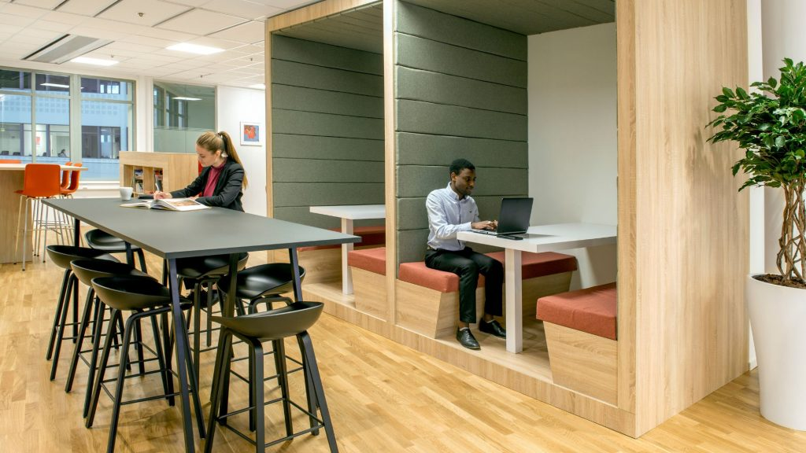

This is about.html and about.css files

Please give me a complete and updated working code for the files both about.html and about.css, then I want you
to add "Meet our Team" section in the page, we are six in our team, display only the first 2,then add "see more" button to display all the team members.

Below are names and portfolio of the team members:
Peerflo Startup Team - Roles and Responsibilities (Assigned)
1. Obedson Uchenna N. (Team Lead) — CEO (Chief Executive Officer)
Leads the team, defines vision and strategy.

Oversees fundraising, partnerships, community engagement.

Brings strong leadership, software development, and community management skills.

2. Uzuagu Abigail Ada — COO (Chief Operating Officer)
Manages daily operations, workspace onboarding, support systems.

Skilled networker with experience in education and real estate — good for partnerships and organizing operations.

3. Nkechi Peace Nwabunike — CTO (Chief Technology Officer)
Oversees technology development, cybersecurity, and platform reliability.

With Computer Science and Cybersecurity background, she fits perfectly to lead technical development.

4. Nkiru Igwe-Okechukwu C. — CPO (Chief Product Officer)
Focuses on user experience (UX), product features, peer learning platform design.

Cybersecurity knowledge + leadership as support team lead = great for managing product feedback, user testing.

5. Ike-Muonso Chidimma. B — CMO (Chief Marketing Officer)
Leads marketing, branding, content creation, and user acquisition.

Skilled in Data Analysis, Visualization, and Graphics — ideal for marketing visuals and campaigns.

6. Purity Ebubechukwu Oguji — CFO (Chief Financial Officer)
Handles finances, fundraising planning, financial projections, and reporting.

Background in health/public service + skills in AI/ML (analytical thinking) — suitable for financial planning and growth projections.

Now this is about.html file:

<!DOCTYPE html>
<html lang="en">
<head>
    <meta charset="UTF-8">
    <meta name="viewport" content="width=device-width, initial-scale=1.0">
    <title>About Peerflo - Local Collaboration Platform</title>
    <link rel="stylesheet" href="index.css"> <!-- Main styles -->
    <link rel="stylesheet" href="./assets/css/about.css"> <!-- About page specific -->
</head>
<body>
    <!-- Header (Synced with index.html) -->
    <header>
        <nav class="navbar">
            

                
            

            <ul class="nav-links">
                <li><a href="index.html">Home</a></li>
                <li><a href="locationSearch.html">Find Workspace</a></li>
                <li><a href="form.html">Share Workspace</a></li>
                <li><a href="about.html" class="active">About</a></li>
            </ul>
            

                
                &#9776;
            

        </nav>
        <!-- Mobile Menu -->
        <ul class="mobile">
            <li><a href="index.html">Home</a></li>
            <li><a href="locationSearch.html">Find Workspace</a></li>
            <li><a href="form.html">Share Workspace</a></li>
            <li><a href="about.html">About</a></li>
        </ul>
    </header>

    <main>
        <!-- Hero Section -->
        <section class="about-hero">
            

                
            

            

                <h1>Empowering Local Collaboration & Learning</h1>
                
Connecting communities through shared workspaces

            

        </section>

        <!-- Profile Section -->
        <section class="profile-section">
            

                <h2>About Peerflo</h2>
                
Peerflo is a location-based digital platform that connects individuals to nearby coworking spaces and peer learning hubs. We solve the problem of discovering local, affordable, and collaborative environments for work, learning, and networking—especially for freelancers, learners, startups, and remote teams.

            

            <!-- Offerings Grid -->
            

                

                    <h3>Core Offerings</h3>
                    <ul>
                        <li>Discover  & book nearby peer-learning hubs and workspaces</li>
                        <li>List coworking or peer-learning hubs</li>
                        <li>Connect with local peer-learning groups and professionals</li>
                        <li>Explore skill-building resources and collaborations</li>
                    </ul>
                

                

                    <h3>Target Audience</h3>
                    <ul>
                        <li>Freelancers & Remote Workers</li>
                        <li>Students & Lifelong Learners</li>
                        <li>Educators & Community Trainers</li>
                        <li>Startups & Entrepreneurs</li>
                    </ul>
                

            

            <!-- Impact Section -->
            

                <h3>The Problem We Solve</h3>
                
Many online learners lack access to physical human support and collaborative spaces for learning or working within their local communities, especially in underserved or non-urban areas. Peerflo bridges that gap by connecting them with physical spaces and communities that foster productivity and growth.

                
                <h3>Our Impact Goal</h3>
                
Drive digital inclusion and innovation from the grassroots by providing accessible platforms for peer-to-peer learning, collaboration, and professional development.

            

        </section>

        <!-- CTA Section -->
        <section class="about-cta">
            <h2>Ready to join the movement?</h2>
            <a href="locationSearch.html" class="cta-button">Find a Workspace</a>
            <a href="form.html" class="cta-button secondary">List Your Space</a>
        </section>
    </main>

    <!-- Footer -->
    <footer>
        

            <a href="#">Facebook</a>
            <a href="#">Twitter</a>
            <a href="#">LinkedIn</a>
            <a href="#">Instagram</a>
        

        
&copy; 2024 Peerflo. All rights reserved.

    </footer>

    
    
    
</body>
</html>

The about.css file:

/* about.css - Peerflo About Page Styles */
/* Maintains all index.html styling while adding page-specific elements */

/* ===== Hero Section ===== */
.about-hero {
  position: relative;
  height: 400px;
  margin-bottom: 2rem;
  overflow: hidden;
}

.hero-image-container img {
  width: 100%;
  height: 100%;
  object-fit: cover;
  filter: brightness(0.8);
}

.hero-text {
  position: absolute;
  top: 50%;
  left: 50%;
  transform: translate(-50%, -50%);
  text-align: center;
  color: white;
  width: 90%;
  max-width: 800px;
  text-shadow: 1px 1px 3px rgba(0,0,0,0.5);
}

.hero-text h1 {
  font-size: 2.5rem;
  margin-bottom: 1rem;
}

.hero-text p {
  font-size: 1.2rem;
}

/* ===== Content Sections ===== */
.profile-section {
  max-width: 1200px;
  margin: 0 auto;
  padding: 0 20px 40px;
}

.profile-card, 
.impact-card {
  background: white;
  border-radius: 8px;
  padding: 2.5rem;
  margin: 2rem 0;
  box-shadow: 0 4px 12px rgba(0,0,0,0.08);
}

.profile-card h2 {
  color: #2c3e50;
  margin-bottom: 1.5rem;
  font-size: 1.8rem;
  text-align: center;
}

/* ===== Grid Layouts ===== */
.offerings-grid {
  display: grid;
  grid-template-columns: repeat(auto-fit, minmax(300px, 1fr));
  gap: 2rem;
  margin: 3rem 0;
}

.offering-card {
  background: #f8f9f9;
  padding: 2rem;
  border-radius: 8px;
  transition: transform 0.3s ease, box-shadow 0.3s ease;
  border-left: 4px solid #18bc9c;
}

.offering-card:hover {
  transform: translateY(-5px);
  box-shadow: 0 6px 16px rgba(0,0,0,0.1);
}

.offering-card h3 {
  color: #2c3e50;
  margin-bottom: 1.2rem;
  font-size: 1.3rem;
}

.offering-card ul {
  list-style-type: none;
  padding-left: 0;
}

.offering-card li {
  margin-bottom: 0.8rem;
  padding-left: 1.8rem;
  position: relative;
  color: #34495e;
  line-height: 1.6;
}

.offering-card li:before {
  content: "•";
  color: #18bc9c;
  font-weight: bold;
  font-size: 1.4rem;
  position: absolute;
  left: 0.5rem;
  top: -0.1rem;
}

/* ===== Impact Section ===== */
.impact-card h3 {
  color: #3498db;
  margin: 1.8rem 0 1rem;
  font-size: 1.4rem;
}

.impact-card p {
  margin-bottom: 1.5rem;
  line-height: 1.7;
}

/* ===== CTA Section ===== */
.about-cta {
  text-align: center;
  padding: 3rem 0;
  background: #ecf0f1;
}

.about-cta h2 {
  color: #2c3e50;
  margin-bottom: 2rem;
  font-size: 1.8rem;
}

.cta-button {
  display: inline-block;
  background: #3498db;
  color: white;
  padding: 12px 30px;
  border-radius: 50px;
  text-decoration: none;
  font-weight: 600;
  margin: 0 10px;
  transition: background 0.3s, transform 0.3s;
  border: none;
  cursor: pointer;
  font-size: 1rem;
}

.cta-button:hover {
  background: #2980b9;
  transform: translateY(-2px);
}

.cta-button.secondary {
  background: #2c3e50;
}

.cta-button.secondary:hover {
  background: #1a252f;
}

/* ===== Responsive Adjustments ===== */
@media (max-width: 768px) {
  .about-hero {
      height: 300px;
  }
  
  .hero-text h1 {
      font-size: 2rem;
  }
  
  .hero-text p {
      font-size: 1rem;
  }
  
  .profile-card, 
  .impact-card {
      padding: 1.8rem;
  }
  
  .cta-button {
      display: block;
      margin: 10px auto;
      max-width: 250px;
  }
}

@media (max-width: 480px) {
  .about-hero {
      height: 250px;
  }
  
  .hero-text h1 {
      font-size: 1.6rem;
  }
  
  .offering-card {
      padding: 1.5rem;
  }
}

Please maintain the design pattern